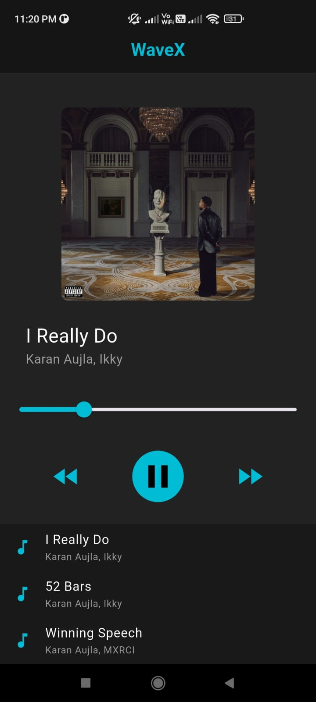
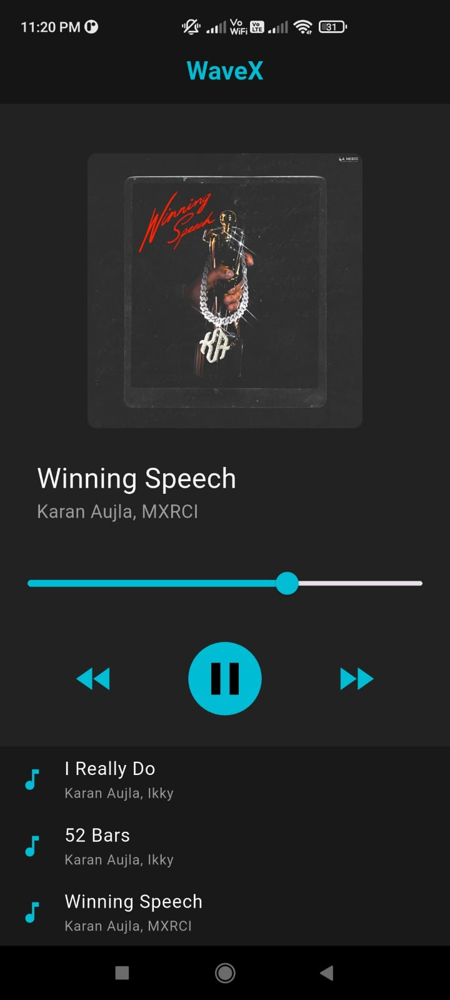

# WaveX 🎵

A simple Flutter music player app built with [audioplayers](https://pub.dev/packages/audioplayers).  
It lets you play, pause, seek, and switch between multiple songs stored locally in your assets.  

---

## 🚀 Features
- Play, pause, and resume music
- Forward & rewind 10 seconds
- Interactive timeline (seek bar)
- Display song title and artist
- Local assets for songs & cover art
- Simple and clean UI

---

## 📸 Screenshots

  
  

